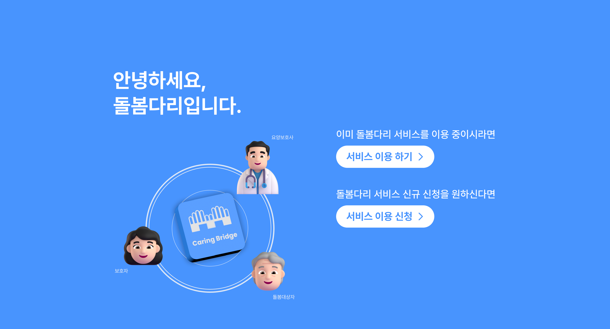
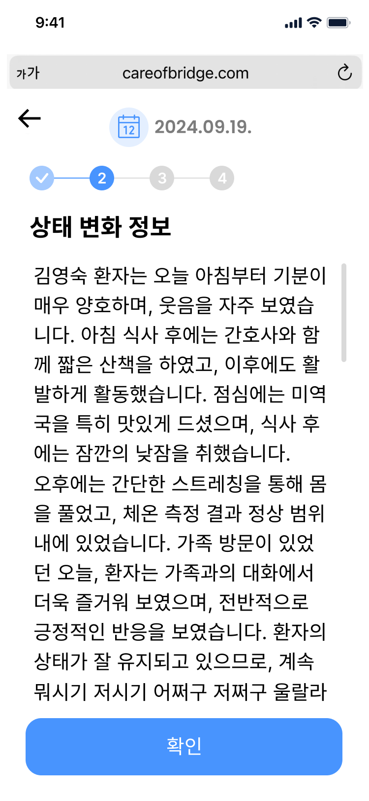
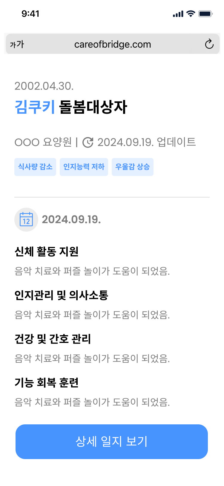
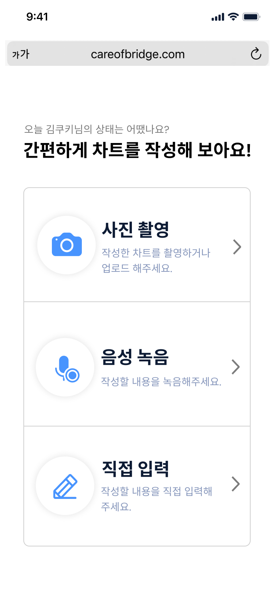
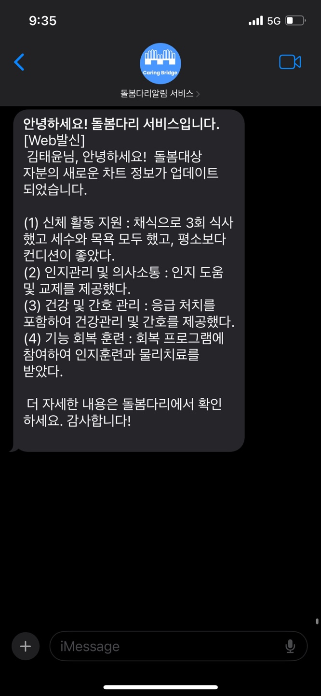
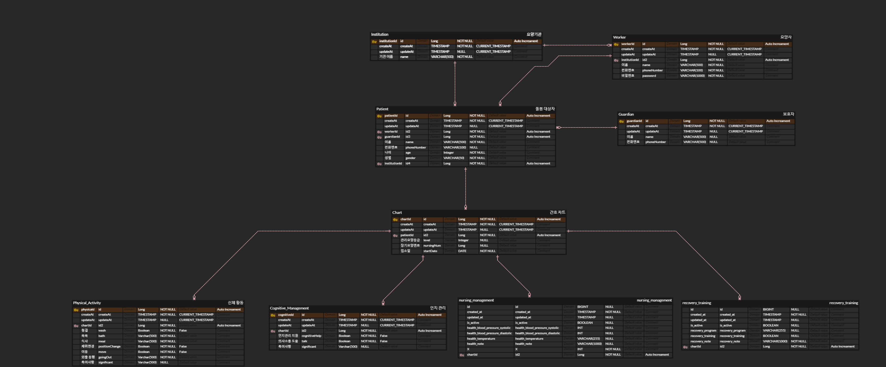

# 🤝 Care Bridge - 요양 일지  서비스

<p align='center'>

</p>


# 🔗 관련 주소

|                         문서                         |
|:--------------------------------------------------:|
|  [백엔드 배포 주소](https://dbdr-servcie.com)  |
| [프론트엔드 배포 주소](https://dbdari.vercel.app/) |
|     [API 문서](https://dbdr-servcie.com/swagger-ui/index.html)     |
|   [디자인 피그마](https://www.figma.com/design/RvPegHAoDLITbqAxexEok7/%EB%B6%80%EC%82%B0%EB%8C%80-13%EC%A1%B0-%EB%81%9D%EB%82%B4%EC%A3%BC%EC%A1%B0?node-id=19-3&node-type=canvas&t=IzVl1agbkGalr8SU-0)    |
|      [프로젝트 노션](https://www.notion.so/example)      |

# 🧐 왜 이 서비스가 필요할까?

## 📝 문제 상황 1: 정보 공유의 단절
- **보호자**는 가족의 상태를 자주 확인하고 싶지만, 요양원에 일일이 연락해야 하는 번거로움과 제한된 정보로 인해 불편을 겪고 있습니다.
- 실시간 상태 확인이 어렵기 때문에, 보호자는 가족의 건강 상태에 대해 지속적인 불안감을 느낄 수 있습니다.


```
보호자의 요구 - 가족의 상태를 실시간으로 확인할 수 있는 간편한 정보 접근 방안이 필요하다.

➡️ 보호자가 어디서든 가족의 상태를 쉽게 확인할 수 있는 시스템이 필요하다!
```

### 🎯 해결 방안
- **실시간 정보 공유** 기능을 통해 보호자가 언제 어디서나 가족의 최신 상태를 확인할 수 있도록 합니다.
- 보호자와 요양보호사 간의 소통을 원활하게 하여 불안감을 줄이고, 신뢰를 강화합니다.

---

## 📝 문제 상황 2: 요양보호사의 차트 작성 어려움
- **요양보호사**는 복잡한 디지털 기록 시스템에 익숙하지 않아 핸드폰으로 차트를 작성하는 과정이 번거롭고 어렵습니다.
- 이러한 어려움은 기록의 정확성과 신속성을 저해하고, 요양보호사의 업무 효율성에도 부정적인 영향을 미칩니다.

<p align='center'>
    
</p>

```
요양보호사의 요구 - 복잡하지 않고 간단한 차트 작성 방식이 필요하다.

➡️ 요양보호사가 쉽게 차트를 작성할 수 있도록 하는 간편한 기록 시스템이 필요하다!
```

### 🎯 해결 방안
- **음성 인식 및 손글씨 인식** 기능을 통해 요양보호사가 복잡한 절차 없이 차트를 쉽게 작성할 수 있도록 지원합니다.
- 기록 작성의 간소화를 통해 요양보호사의 부담을 줄이고, 환자의 상태를 신속하고 정확하게 기록할 수 있도록 합니다.

---

# 🌟 Care Bridge란?

> **요양보호사**는 간편하게 차트를 작성하고,  
> **보호자**는 이를 실시간으로 확인할 수 있는 **디지털 차트 서비스**

- 보호자는 **언제 어디서나 가족의 상태를 확인**
- 요양보호사는 **복잡함 없이 기록을 관리**

**➡️ 신뢰와 편리성을 제공하는 소통 플랫폼**


## 🧩 주요 기능

### 보호자
|                             🩺 **돌봄대상자 차트 확인**                             | 📝 **차트 요약** |
|:--------------------------------------------------------------------------:|:--:|
|               - **하루 상태 기록 확인**<br/> - 사진과 차트 작성 시 **알림 수신**               | - 긴 차트를 **핵심 내용 요약**<br/> - 주요 사항을 **간결하게 확인** |
|  |  |

### 요양보호사
|                              🖋️ **요양 일지 작성**                               | 🎙️ **음성 인식 차트 작성** |
|:---------------------------------------------------------------------------:|:-:|
|             - **음성/사진 인식**, 직접 작성 지원<br/> - **다양한 방식으로 간편 작성**              | - **음성 인식**을 통해 주관식 입력<br/> - 음성을 텍스트로 **자동 변환** |
|  | |


|                                 📷 **OCR 차트 작성**                                 |                                  📑 **차트 요약 기능**                                  |                              🔔 **알림 기능**                               |
|:--------------------------------------------------------------------------------:|:---------------------------------------------------------------------------------:|:-----------------------------------------------------------------------:|
|               - **차트 양식 프린트 후 사진 인식**<br/> - 사진 한 장으로 **자동 기록 완성**               |                  - **환자 상태 요약 제공**<br/> - 여러 환자의 **하루 상태 간편 확인**                  |               - 사용자가 예약한 시간마다<br/> - 문자/라인 메시지로 차트 작성 알림                |
|  |  |  |


### 요양원
|                                   🖥️ **요양사, 보호자, 돌봄대상자 관리**                                   |                                     📊 **엑셀 업로드**                                      |
|:----------------------------------------------------------------------------------------------:|:--------------------------------------------------------------------------------------:|
|                      - **웹사이트로 정보 관리**<br/> - 요양사, 보호자, 대상자 정보 **수정 가능**                       |                  - 엑셀 파일로 **대량 데이터 업로드**<br/> - 제공된 템플릿 파일로 **간편 등록**                  |
|  |  |

## 🔧 BE 핵심 개발 영역
### 엑셀 파일 관리 기능
엑셀 파일 관리 기능을 도입한 이유는 요양원에서 다수의 요양보호사, 보호자, 돌봄대상자 정보를 한꺼번에 등록하려 할 때 더 효율적으로 관리할 수 있도록 하기 위함입니다. 이를 통해 개별적인 수작업 입력 대신 엑셀 파일을 이용해 일괄적으로 데이터를 업로드할 수 있어 시간을 크게 절감할 수 있습니다.
-   템플릿 파일 제공: 요양보호사, 보호자, 돌봄대상자별로 필요한 정보가 포함된 엑셀 템플릿(.xlsx)을 제공합니다. 사용자는 이 템플릿을 다운로드해 여러 개의 데이터를 입력한 후 업로드합니다.
-   유효성 검사 및 중복 검사: 서버에서 업로드된 파일을 읽어 각 행의 데이터를 유효성 및 중복 검사합니다. 휴대폰 번호나 장기요양인정번호가 중복되거나 입력 데이터의 형식이 맞지 않으면 해당 데이터는 저장되지 않습니다.
-   데이터 저장: 검사를 통과한 데이터만 successList로 데이터베이스에 저장됩니다. 오류가 있는 데이터는 failedList로 반환되고, 이를 통해 오류가 있는 데이터는 데이터베이스에 저장되지 않고, 오류가 없는 정상적인 데이터만 안전하게 저장됩니다.

### AI 요약 기능 - 파인 튜닝
보호자들이 차트 정보를 전부 보게 되면 너무 많은 정보로 인해 돌봄 대상자의 상태를 이해하기 어렵습니다. 이를 해결하기 위해 차트 정보를 요약하여 보여주는 AI 기능을 구현하였습니다.

ChatGPT를 바로 사용하면 원하는 형식으로 결과가 나오지 않거나 불필요한 정보가 포함되는 경우가 있어, 파인튜닝을 선택했습니다. 차트 관련 요약 데이터셋이 존재하지 않아 AI-Hub의 한국어 대화 요약 데이터셋을 가져와 파인튜닝을 진행했습니다.

conditionDisease, bodyManagement, nursingManagement, recoveryTraining, cognitiveManagement와 같이 값을 나누어 요약하도록 만들었습니다. 파인튜닝을 하지 않았다면 매번 JSON 형식으로 특정 방식의 값을 달라고 명령해야 했겠지만, 파인튜닝을 통해 차트 값만 JSON 형식으로 주면 원하는 형식으로 바로 받아올 수 있게 되었습니다.

또한, 프론트에서 사용할 세 가지 태그를 요약하도록 파인튜닝을 추가로 진행했습니다. 프론트와의 연동 과정에서 태그를 추가하는 것이 좋겠다는 의견이 나와 이를 반영하게 되었습니다. 차트 데이터를 만드는 과정이 생각보다 오래 걸려 태그까지 추가하여 다시 파인튜닝을 진행하는 것은 어렵다고 판단하였고, 그에 따라 태그는 따로 파인튜닝을 하는 것으로 결정하게 되었습니다.

AI가 가끔 null 값을 반환하는 문제가 있었지만, 대부분 한 번 더 시도하면 정상적으로 동작했습니다. 이에 따라 백엔드 서비스에서 첫 번째 시도에 성공하지 않을 경우 최대 세 번까지 재시도하도록 수정하였으며, 세 번 시도 후에도 응답이 없으면 그때 프론트에 에러 메시지를 보내도록 변경하였습니다

### 리프레시 토큰
우리 서비스는 민감한 의료 데이터를 다루는 만큼, 토큰 보안에 각별한 주의를 기울였습니다. 로그인 시 액세스 토큰과 리프레시 토큰을 발급하며, 리프레시 토큰을 통해 재발급이 이루어질 때는 보안을 강화하기 위해 RTR(Refresh Token Rotation) 방식을 사용해 두 토큰을 모두 새로 발급했습니다. 이렇게 함으로써, 토큰 재사용에 따른 보안 취약점을 최소화했습니다.

또한, 로그아웃 시 토큰을 즉시 만료시키기 위해 Redis를 활용했습니다. 리프레시 토큰을 Redis에 저장하고, 오직 저장된 토큰만 유효하도록 설정함으로써 로그아웃 시 Redis에서 해당 토큰을 삭제해 만료 처리를 간편하게 관리했습니다. 이와 함께 액세스 토큰은 로그아웃 시 Redis 블랙리스트에 추가해 로그아웃 이후에는 유효하지 않도록 조치했습니다.
## 🧩 ERD
<p align='center'>
    
</p>

## ⚙️ 개발 스택

<div align="center">


</div>

# 🧑‍💻 Collaborators

<h3 align="center">Backend</h3>

<div align="center">

| **테크 리더** | **기획 리더** | **리액셔너** | **리마인더** | **리마인더** |
| ------------- | ------------- | ------------ | ------------ | ------------ |
| <div align="center">[이영준](https://github.com/20jcode)</div> | <div align="center">[김태윤](https://github.com/pykido)</div> | <div align="center">[유경미](https://github.com/yooookm)</div> | <div align="center">[박혜연](https://github.com/hyyyh0x)</div> | <div align="center">[이진솔](https://github.com/mogld)</div> |
| <div align="center"></div> | <div align="center"></div> | <div align="center"></div> | <div align="center"></div> | <div align="center"></div> |

</div>

<h3 align="center">Frontend</h3>


<div align="center">

| **조장**      | **타임 키퍼** |
| ------------- | ------------- |
|<div align="center">[문정윤](https://github.com/nnoonjy)</div>|<div align="center">[이지수](https://github.com/dlwltn0430)</div> |
| <div align="center"></div> | <div align="center"></div> |

</div>
