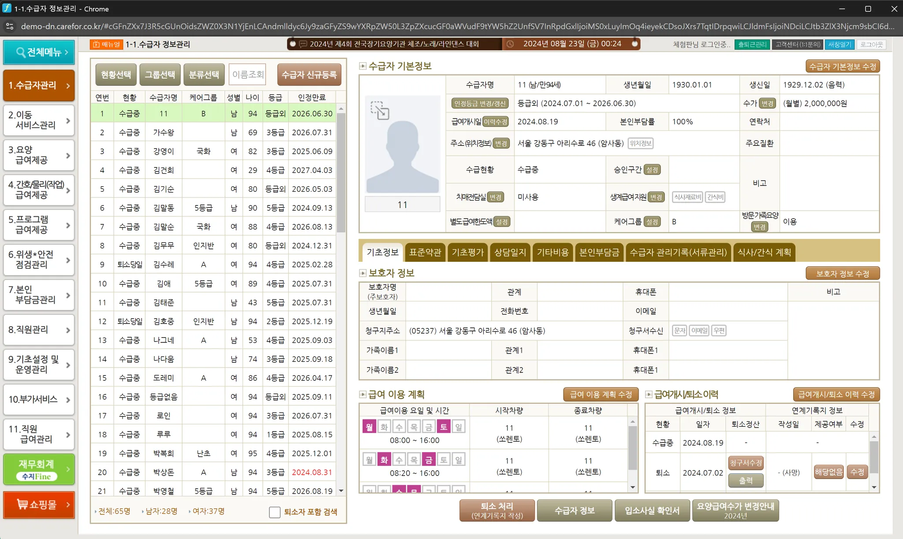
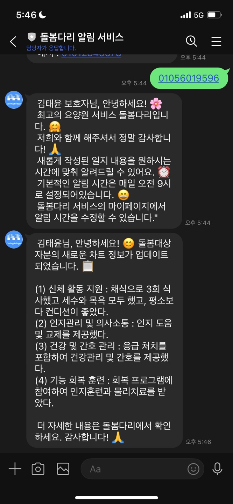

# 🤝 Care Bridge - 요양 일지  서비스

<p align='center'>

</p>
<br/>

# 🔗 관련 주소

|                         문서                         |
|:--------------------------------------------------:|
|  [백엔드 배포 주소](https://dbdr-servcie.com)  |
| [프론트엔드 배포 주소](https://dbdari.vercel.app/) |
|     [API 문서](https://dbdr-servcie.com/swagger-ui/index.html)     |
|   [디자인 피그마](https://www.figma.com/design/RvPegHAoDLITbqAxexEok7/%EB%B6%80%EC%82%B0%EB%8C%80-13%EC%A1%B0-%EB%81%9D%EB%82%B4%EC%A3%BC%EC%A1%B0?node-id=19-3&node-type=canvas&t=IzVl1agbkGalr8SU-0)    |
|      [프로젝트 노션](https://www.notion.so/example)      |

<br/>

---
# 🧐 왜 이 서비스가 필요할까?

## 📝 문제 상황 1: 정보 공유의 단절
- **보호자**는 가족의 상태를 자주 확인하고 싶지만, 요양원에 일일이 연락해야 하는 번거로움과 제한된 정보로 인해 불편을 겪고 있습니다.
- 실시간 상태 확인이 어렵기 때문에, 보호자는 가족의 건강 상태에 대해 지속적인 불안감을 느낄 수 있습니다.


```
보호자의 요구 - 가족의 상태를 실시간으로 확인할 수 있는 간편한 정보 접근 방안이 필요하다.

➡️ 보호자가 어디서든 가족의 상태를 쉽게 확인할 수 있는 시스템이 필요하다!
```

### 🎯 해결 방안
- **실시간 정보 공유** 기능을 통해 보호자가 언제 어디서나 가족의 최신 상태를 확인할 수 있도록 합니다.
- 보호자와 요양보호사 간의 소통을 원활하게 하여 불안감을 줄이고, 신뢰를 강화합니다.

<br/>

## 📝 문제 상황 2: 요양보호사의 차트 작성 어려움
- **요양보호사**는 복잡한 디지털 기록 시스템에 익숙하지 않아 핸드폰으로 차트를 작성하는 과정이 번거롭고 어렵습니다.
- 이러한 어려움은 기록의 정확성과 신속성을 저해하고, 요양보호사의 업무 효율성에도 부정적인 영향을 미칩니다.

<p align='center'>
    
</p>

```
요양보호사의 요구 - 복잡하지 않고 간단한 차트 작성 방식이 필요하다.

➡️ 요양보호사가 쉽게 차트를 작성할 수 있도록 하는 간편한 기록 시스템이 필요하다!
```

### 🎯 해결 방안
- **음성 인식 및 손글씨 인식** 기능을 통해 요양보호사가 복잡한 절차 없이 차트를 쉽게 작성할 수 있도록 지원합니다.
- 기록 작성의 간소화를 통해 요양보호사의 부담을 줄이고, 환자의 상태를 신속하고 정확하게 기록할 수 있도록 합니다.

<br/>

---

# 🌟 Care Bridge란?

> **요양보호사**는 간편하게 차트를 작성하고,  
> **보호자**는 이를 실시간으로 확인할 수 있는 **디지털 차트 서비스**

- 보호자는 **언제 어디서나 가족의 상태를 확인**
- 요양보호사는 **복잡함 없이 기록을 관리**

**➡️ 신뢰와 편리성을 제공하는 소통 플랫폼**

<br/>

## 🧩 주요 기능

### 보호자
|                             🩺 **돌봄대상자 차트 확인**                             | 📝 **차트 요약** |
|:--------------------------------------------------------------------------:|:--:|
|               - **하루 상태 기록 확인**<br/> - 사진과 차트 작성 시 **알림 수신**               | - 긴 차트를 **핵심 내용 요약**<br/> - 주요 사항을 **간결하게 확인** |
|  |  |

### 요양보호사
|                              🖋️ **요양 일지 작성**                               | 🎙️ **음성 인식 차트 작성** |
|:---------------------------------------------------------------------------:|:-:|
|             - **음성/사진 인식**, 직접 작성 지원<br/> - **다양한 방식으로 간편 작성**              | - **음성 인식**을 통해 주관식 입력<br/> - 음성을 텍스트로 **자동 변환** |
|  ||


|                                 📷 **OCR 차트 작성**                                 |                                  📑 **차트 요약 기능**                                  |                              🔔 **알림 기능**                               |
|:--------------------------------------------------------------------------------:|:---------------------------------------------------------------------------------:|:-----------------------------------------------------------------------:|
|               - **차트 양식 프린트 후 사진 인식**<br/> - 사진 한 장으로 **자동 기록 완성**               |                  - **환자 상태 요약 제공**<br/> - 여러 환자의 **하루 상태 간편 확인**                  |               - 사용자가 예약한 시간마다<br/> - 문자/라인 메시지로 차트 작성 알림                |
|  |  |  |


### 요양원
|                                   🖥️ **요양사, 보호자, 돌봄대상자 관리**                                   |                                     📊 **엑셀 업로드**                                      |
|:----------------------------------------------------------------------------------------------:|:--------------------------------------------------------------------------------------:|
|                      - **웹사이트로 정보 관리**<br/> - 요양사, 보호자, 대상자 정보 **수정 가능**                       |                  - 엑셀 파일로 **대량 데이터 업로드**<br/> - 제공된 템플릿 파일로 **간편 등록**                  |
|  | |

<br/>

## 🔧 공통 핵심 개발 영역

### 회원가입 방법
- 사용자의 연령층을 고려할 때, 직접 회원가입하고 정보를 등록하는 것이 어려울 것이라 생각하여 요양원이나 관리자가 돌봄대상자나 보호자의 아이디, 비밀번호를 생성해줍니다.
- 돌봄대상자와 보호자는 비밀번호만 기억하면 서비스 이용이 가능하도록 아이디는 본인의 전화번호로 등록하도록 구현하였습니다.
- 관리자는 요양원, 보호자, 돌봄대상자, 요양보호사를 등록할 수 있습니다.
- 요양원은 보호자, 돌봄대상자, 요양보호사를 해당 요양원에 등록할 수 있습니다.
- 관리자의 경우 랜딩 페이지에 적힌 이메일로 contact하여 신분과 목적을 인증한 뒤 본 서비스 담당자가 아이디 비밀번호를 부여해줍니다.

## 🔧 FE 핵심 개발 영역

### OCR 기능
1. **고려 사항**
  
2. **구현 방법**

3. **문제 해결**

### 음성인식 기능
1. **구현 방법**
    - SpeechToText 훅을 구현하여 녹음시작, 녹음중지, 다시 녹음이 가능하게 합니다.
    - 녹음 중에 제대로 인식이 되고 있는지 실시간으로 화면에 띄워주어 확인이 가능하게 합니다.
    - 조금 부족한 부분은 음성인식 완료 후 작성 페이지에서 직접 수정이 가능하도록 합니다.
2. **문제 해결**
    - 녹음 중 텍스트가 화면에 제대로 띄워지지 않고 중지, 시작 버튼이 제대로 작동하지 않았었는데, 상태 변수를 여러개를 사용하다보니 그러한 문제가 발생하였던 것이었습니다. 최대한 적은 상태변수를 사용하여 이러한 문제를 해결하였습니다.

### 차트작성 기능
1. **고려 사항**
    - 본 사이트의 유저들의 연령대를 고려하여 최대한 단순하고 직관적이게 구현해야합니다.
    - 의료와 관련이 있는 서비스이므로 일지 작성에 필수적인 항목들을 빠짐없이 복잡하지 않으면서도 구성해야합니다.
2. **구현 방식**
    - 국가에서 규정하고 있는 일지에 들어가야하는 항목들을 대분류에 따라 step으로 나누어 최대한 잘게 나누어서 입력을 받았습니다.
    - 다른 형태의 입력을 받더라도 디자인은 최대한 비슷하게 컴포넌트를 구현하여 피로감을 덜었습니다.
  
### 차트 수정 및 삭제
1. **고려 사항**
    - 차트를 미리 작성해두고 시간이 지난 뒤에 무분별하게 차트를 수정하면 보호자가 불만을 가질 수 있습니다. 따라서 차트 수정은 당일 작성한 차트만 가능하게 하였습니다.
2. **구현 방식**
    - 요양보호사의 권한으로 돌봄대상자 차트 작성 아이콘을 누르면 현재 날짜와 비교하여 존재하는 차트가 있으면 차트 수정을, 없으면 새로운 차트 작성을 하게끔 구현하였습니다.
    - 차트 삭제의 경우 요약일지 페이지에 삭제 버튼을 두어 삭제가 가능하게끔 했습니다.
  
### 로그인 및 로그아웃
1. **로그인**
    - 요양보호사와 보호자는 전화번호와 비밀번호로, 요양원과 관리자는 아이디와 비밀번호로 로그인이 가능하게 화면을 구성하였습니다.
    - 필요한 항목들을 넣고 로그인을 하면 accessToken과 refreshToken을 받아오고 추후 accessToken이 만료되면 저장된 refreshToken으로 새로운 accessToken과 refreshToken을 발급받습니다.
2. **로그아웃**
    - 로그아웃을 자주 이용하는 서비스가 아니므로 로그아웃 기능은 화면 우측 상단에 프로필 사진을 누르면 이동하는 마이페이지에서 로그아웃이 가능하도록 구현하였습니다.
    - 로그아웃시 랜딩페이지로 이동하여 다시 로그인이 가능하게끔 합니다.

### 사용자의 편리를 위해 세세하게 신경 쓴 화면
1. 단순하고 깔끔한 UI
    - 한 화면에 적당한 양의 항목들만을 배치하여 여백을 주어 차트를 조회하거나 작성할 때에 피로하지 않도록 합니다.
    - 직관적인 버튼으로 사용이 어렵지 않게 구현합니다.
2. **캘린더**로 존재하는 차트 내역 한눈에 확인 가능
    - 차트를 매일 작성하지는 않는다는 특성상 현재 존재하는 차트의 작성일을 불러와 캘린더에 표시해줍니다.
    - 표시된 날짜를 클릭하면 해당 날짜에 작성된 일지에 대한 AI 요약일지, 전체 일지 내역을 확인할 수 있습니다.
    - 차트가 존재하지 않는 날짜는 선택할 수 없게 하여 사용하기 용이하게 하였습니다.
3. 일지 작성 또는 열람시 **step**을 표시
    - 단계바 클릭시 해당 step으로 넘어가게 하여 작성시에는 앞서 작성한 내용의 수정이, 열람시에는 원하는 step 확인이 용이하게 합니다.
    - 일지 작성시에는 현재 작성 중인 step 이후의 step으로는 넘어가지 못하게 하여 작성 내용 누락을 방지하였습니다.
    - 일지 열람시에는 자유롭게 step 이동이 가능합니다.
4. 웹 혹은 태블릿 화면에서의 **화면 너비 고정**
    - 단순한 화면을 위하여 단계를 잘게 나눈 만큼 한 화면에서 수행해야할 동작들이 적은 편이고 화면도 단순한 편인 것을 고려하여 화면이 더 넓어지더라도 최대 너비를 고정하여 UI가 깔끔하게 유지할 수 있게끔 구현하였습니다.
    - 관리자나 요양 기관에서는 컴퓨터를 사용하여 표를 관리할 것을 고려하여 웹 화면 규격에 맞추어 구현하였습니다.
    - 랜딩페이지의 경우 모든 화면에서도 자연스럽게 보이도록 반응형으로 구현하였습니다.

### 자연스러운 랜딩페이지
1. **고려 사항**
    웹과 태블릿, 휴대폰 등 다양한 규격으로 사용하는 홈페이지이기에 자칫하면 어색한 배치의 화면이 띄워지는 화면이 띄워질 수 있습니다. 이를 방지하기 위하여 어느 크기의 화면에서도 자연스럽게 보이게 구현하였습니다. 
2. **구현 방식**
    - breakpoints.ts에 네가지 규격를 저장하여 해당 수치에 못 미치거나 초과할때 글씨 크기나 아이템들의 배치를 수정합니다.
    - 배치에 맞게 애니메이션을 추가하여 뚝뚝 끊기지않고 부드러운 느낌이 들게 구현하였습니다.

## 🔧 BE 핵심 개발 영역

### OCR 기능

요양보호사가 작성한 돌봄 대상자 차트를 효율적으로 디지털화하기 위해 Naver Clova OCR API와 AWS S3의 presigned URL을 사용했습니다.

presigned URL을 통해 이미지 파일을 S3에 업로드하고, 백엔드 서버에는 objectKey 값만 전달하여 OCR을 수행하는 방식으로 서버 과부하를 방지하고 성능을 최적화했습니다. 이로써 서버 리소스를 절약하면서도 보안성을 유지한 상태에서 차트를 안전하게 OCR 처리할 수 있도록 구현했습니다.
<p >

</p>

<br/>

### AI 요약 기능 - 파인 튜닝
1. **고려 사항**

    - 보호자들이 차트 정보를 모두 보면 너무 많은 정보로 인해 돌봄 대상자의 상태를 파악하기 어려울 수 있습니다. 이를 해결하기 위해 차트 정보를 간결하게 요약하여 보여주는 기능을 구현하였습니다.


2. **기술 선택 이유(파인튜닝)**

    - 모델 파인튜닝: 기존의 ChatGPT를 사용할 때 원하는 형식으로 결과가 나오지 않거나 불필요한 정보가 포함되는 경우가 있어, 모델을 파인튜닝하는 방법을 선택했습니다. 파인튜닝을 하지 않았다면 매번 JSON 형식으로 특정 방식의 값을 요구해야 했겠지만, 이제는 차트 데이터를 JSON 형식으로 입력하면 원하는 형식의 결과를 바로 받을 수 있습니다.


3. **구현 방식**

   - 파인튜닝: 차트 요약과 관련된 데이터셋이 없어 AI-Hub의 한국어 대화 요약 데이터셋을 활용하여 파인튜닝을 진행했습니다. conditionDisease, bodyManagement, nursingManagement, recoveryTraining, cognitiveManagement와 같은 항목별로 요약하도록 만들었습니다.

   - 태그 요약 적용: 프론트엔드에서 사용할 세 가지 태그를 요약하도록 파인튜닝을 추가로 진행했습니다. 프론트엔드와의 연동 과정에서 태그를 추가하는 것이 유용할 것이라는 의견을 반영하여 이를 구현했습니다. 차트 데이터를 준비하는 데 시간이 많이 소요되었기 때문에 태그를 추가하여 다시 파인튜닝하는 것이 어렵다고 판단했고, 대신 태그를 위한 파인튜닝을 별도로 진행하는 것으로 결정했습니다.

4. **문제 해결**
   - 가끔 AI가 null 값을 반환하는 문제가 있었지만, 대부분 한 번 더 시도하면 정상적으로 동작했습니다. 이에 따라 백엔드 서비스에서 첫 번째 시도에 성공하지 않을 경우 최대 세 번까지 재시도하도록 수정하였고, 세 번 시도 후에도 응답이 없을 경우 그때 프론트엔드에 에러 메시지를 보내도록 변경했습니다.

<br/>

### 알림 서비스
1. **구현 방법**
- Spring 스케줄러를 활용하여 매분마다 알림 시간이 도래한 요양보호사와 보호자를 찾아 필요한 알림 메시지를 전송합니다.
- 알림 메시지는 미리 정의된 템플릿을 기반으로 구성하며, 사용자가 선택한 알림 수단(Line 또는 SMS)에 맞춰 발송됩니다.
- 사용자 편의를 위해 ‘마이페이지’에서 Line 알림 서비스와 SMS 알림 서비스를 선택할 수 있는 옵션을 제공했습니다.

2. **문제 해결**
- 메시지 전송 중복 및 전송 실패 시 오류 처리가 어려웠던 부분은 Amazon SQS를 통해 메시지 큐 관리 기능을 추가하여 문제를 해결했습니다.
- 카카오 비즈니스 채널 가입에 필요한 서류 심사에서 반려되었으나, 장기적으로 카카오 알림톡 도입 가능성을 염두에 두고, 현재는 Line과 SMS API를 대체 수단으로 활용했습니다.

<br/>

### 엑셀 파일 관리 기능
엑셀 파일 관리 기능을 통해 요양원에서 다수의 요양보호사, 보호자, 돌봄대상자 정보를 한 번에 효율적으로 등록할 수 있습니다. 요양원은 제공된 엑셀 템플릿 파일을 다운로드해 데이터를 일괄적으로 입력하고 업로드하여 개별 입력보다 시간을 절감할 수 있습니다.

업로드된 파일은 서버에서 유효성 검사와 중복 검사를 거쳐 형식이 맞지 않거나 중복된 데이터는 데이터베이스에 저장되지 않습니다. 검사를 통과한 데이터만 데이터베이스에 저장되며, 검사에 통과하지 못한 오류 데이터는 데이터베이스에 저장되지 않아, 정상 데이터만 안전하게 관리됩니다.

<br/>

### 리프레시 토큰
우리 서비스는 민감한 의료 데이터를 다루기에, 토큰 보안이 중요했습니다. 로그인 시 액세스 토큰과 리프레시 토큰을 발급하고, 리프레시 토큰으로 재발급 시 두 토큰을 모두 새로 발급하는 RTR 방식을 적용해 보안을 강화했습니다. 로그아웃 시에는 Redis에 저장된 리프레시 토큰을 삭제하고, 액세스 토큰은 블랙리스트에 등록해 유효성을 차단했습니다. 이를 통해 로그아웃 시 실시간으로 토큰 만료를 효과적으로 처리할 수 있었습니다.

<br/>

## 🧩 ERD
<p align='center'>
    
</p>

<br/>

## ⚙️ 개발 스택

<div align="center">


</div>

<br/>

# 🧑‍💻 Collaborators

<h3 align="center">Backend</h3>

<div align="center">

| **테크 리더** | **기획 리더** | **리액셔너** | **리마인더** | **리마인더** |
| ------------- | ------------- | ------------ | ------------ | ------------ |
| <div align="center">[이영준](https://github.com/20jcode)</div> | <div align="center">[김태윤](https://github.com/pykido)</div> | <div align="center">[유경미](https://github.com/yooookm)</div> | <div align="center">[박혜연](https://github.com/hyyyh0x)</div> | <div align="center">[이진솔](https://github.com/mogld)</div> |
| <div align="center"></div> | <div align="center"></div> | <div align="center"></div> | <div align="center"></div> | <div align="center"></div> |

</div>

<h3 align="center">Frontend</h3>


<div align="center">

| **조장**      | **타임 키퍼** |
| ------------- | ------------- |
|<div align="center">[문정윤](https://github.com/nnoonjy)</div>|<div align="center">[이지수](https://github.com/dlwltn0430)</div> |
| <div align="center"></div> | <div align="center"></div> |

</div>
